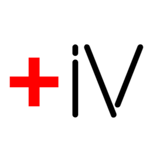

# InfoVITA

<h3>Descrição</h3>
Projeto que visa tornar informações sobre a saúde pública mais acessível aos cidadãos brasileiros.

<h3>Funcionalidades</h3>
<ul>
  <li>Buscar por clinicas ou tipos de exames</li>
  <li>Geolocalização dos itens buscados</li>
  <li>Filtragem nas buscas</li>
  <li>Informações sobre as clinicas</li>
  <li>Avaliar clinicas e comentar sobre as mesmas</li>
</ul>

<h3>Status Atual</h3>
Em desenvolvimento

<h3>Wireframes(Canva)</h3>

https://www.canva.com/design/DAFM3EqnZFo/7d19HkEYhteWt3IWkM2r3Q/view?utm_content=DAFM3EqnZFo&utm_campaign=designshare&utm_medium=link&utm_source=publishsharelink

<h3>Sprint Backlog - Trello<h3/>

https://trello.com/

<h3>Fonte de dados</h3>

https://cnes2.datasus.gov.br/

<h3>Product backlog</h3>

https://docs.google.com/spreadsheets/d/19ayIM9UR7kCvOkhkvzkTl4vbUP4e1Jst/edit?usp=drivesdk&ouid=112740340605020176864&rtpof=true&sd=true

